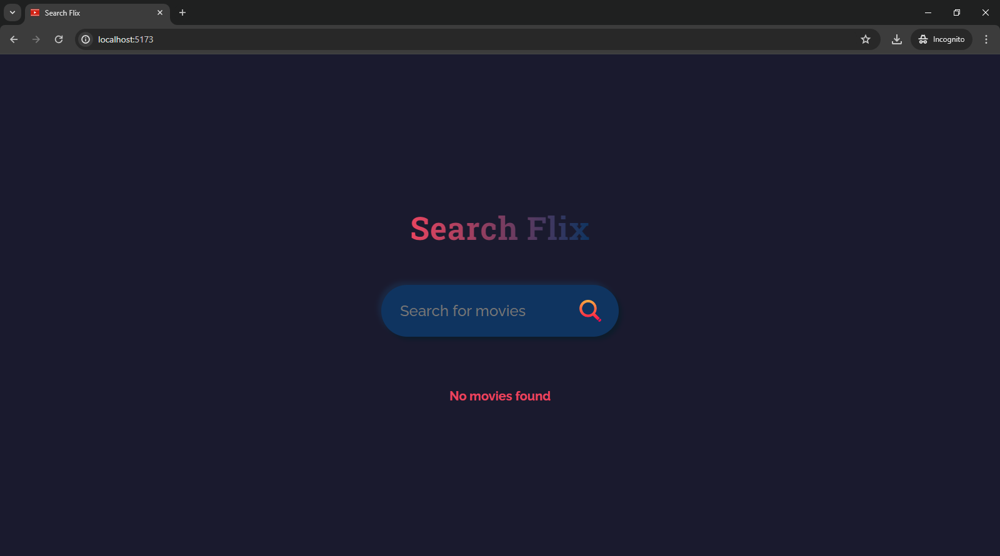
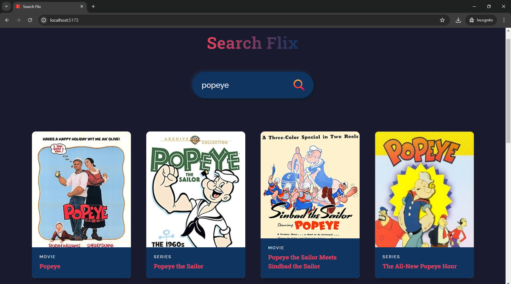

# Search Flix

Search Flix is a movie and series search application built using React.js. The application fetches data from the OMDB API to display information about movies and series.

## Table of Contents

- [Installation](#installation)
- [Usage](#usage)
- [Features](#features)
- [Screenshots](#screenshots)
- [Technologies](#technologies)

## Installation

1. Clone the repository:
    ```bash
    git clone https://github.com/your-username/search-flix.git
    cd search-flix
    ```

2. Install dependencies:
    ```bash
    npm install
    ```

3. Create a `.env` file in the root directory and add your OMDB API key:
    ```plaintext
    REACT_APP_OMDB_API_KEY=your_api_key_here
    ```

4. Start the development server:
    ```bash
    npm start
    ```

5. Open your browser and navigate to `http://localhost:3000` to see the application in action.

## Usage

1. Enter the name of a movie or series in the search bar.
2. Click the search icon or press enter to fetch the results from the OMDB API.
3. Browse through the search results to find the movie or series you are looking for.

## Features

- Search for movies and series by title.
- Display detailed information about each movie and series.
- Interactive and responsive UI.

## Screenshots

### Initial Screen


### Search Results


## Technologies

- React.js
- OMDB API
- CSS

## License

This project is licensed under the MIT License. See the [LICENSE](LICENSE) file for details.
